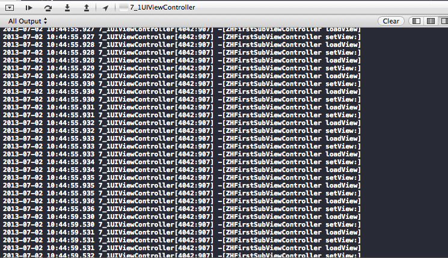

7月1日 UIVIewController
====
Proj:7_1UIViewController
---
* Target：
	1. **View生命周期**
	2. **视图内存控制**
	3. **复合视图设计**

* Via：

	通过阅读appledoc对viewController的属性和medhods的理解和认识在proj中在几个重要的关于视图life cycle和memory管理的方法中做测试，内容主要有以下几点：
		
	* 视图创建，加载以及卸载的时机
	* didReceiveMemoryWarning方法在收到内存警告时并且在ARC下会做那些操作，其中测试几种环境下的该方法的操作：
		1. 视图在前台显示
		2. 视图已被push，比如navigation
		3. 应用在后台
	* 在内存警告后视图在哪里进行重建的问题
	* 在父视图中添加过多的SubView会带来的问题（尝试替代用drawRect方法实现）
	
	
### 测试时发现无法重写view的set,get方法，导致加载视图时无限循环
###（在set方法中通过_view访问view实例则无法通过编译） :(

	
ZHFirstSubViewController为第一个控制器，视图为A，ZHSecondViewController为第二个控制器，视图为B.
---

---

第一次
---

* `第一次从父视图加载A视图时日志如下：`

2013-07-01 18:06:07.038 7_1UIViewController[6617:907] -[ZHFirstSubViewController loadView]

2013-07-01 18:06:07.040 7_1UIViewController[6617:907] -[ZHFirstSubViewController viewDidLoad]

2013-07-01 18:06:07.041 7_1UIViewController[6617:907] -[ZHFirstSubViewController viewWillAppear:]

2013-07-01 18:06:07.463 7_1UIViewController[6617:907] -[ZHFirstSubViewController viewDidAppear:]

* `第一次再加载视图B，日志如下：`

2013-07-01 18:06:26.857 7_1UIViewController[6617:907] -[ZHSecondViewController loadView]

2013-07-01 18:06:26.858 7_1UIViewController[6617:907] -[ZHSecondViewController viewDidLoad]

2013-07-01 18:06:26.859 7_1UIViewController[6617:907] -[ZHFirstSubViewController viewWillDisappear:]

2013-07-01 18:06:26.860 7_1UIViewController[6617:907] -[ZHSecondViewController viewWillAppear:]

2013-07-01 18:06:27.284 7_1UIViewController[6617:907] -[ZHFirstSubViewController viewDidDisappear:]

2013-07-01 18:06:27.284 7_1UIViewController[6617:907] -[ZHSecondViewController viewDidAppear:]

* `从B返回到A视图，日志如下：`

2013-07-01 18:06:43.692 7_1UIViewController[6617:907] -[ZHSecondViewController viewWillDisappear:]

2013-07-01 18:06:43.693 7_1UIViewController[6617:907] -[ZHFirstSubViewController viewWillAppear:]

2013-07-01 18:06:44.118 7_1UIViewController[6617:907] -[ZHSecondViewController viewDidDisappear:]

2013-07-01 18:06:44.118 7_1UIViewController[6617:907] -[ZHFirstSubViewController viewDidAppear:]

* `从A返回到父视图：`

2013-07-01 18:07:07.279 7_1UIViewController[6617:907] -[ZHFirstSubViewController viewWillDisappear:]

2013-07-01 18:07:07.705 7_1UIViewController[6617:907] -[ZHFirstSubViewController viewDidDisappear:]

第二次
---

* `第二次从父视图加载A`

2013-07-01 18:07:30.721 7_1UIViewController[6617:907] -[ZHFirstSubViewController viewWillAppear:]

2013-07-01 18:07:31.142 7_1UIViewController[6617:907] -[ZHFirstSubViewController viewDidAppear:]

* `第二次从A到B：`

2013-07-01 18:07:45.952 7_1UIViewController[6617:907] -[ZHFirstSubViewController viewWillDisappear:]

2013-07-01 18:07:45.952 7_1UIViewController[6617:907] -[ZHSecondViewController viewWillAppear:]

2013-07-01 18:07:46.375 7_1UIViewController[6617:907] -[ZHFirstSubViewController viewDidDisappear:]

2013-07-01 18:07:46.376 7_1UIViewController[6617:907] -[ZHSecondViewController viewDidAppear:]

* `第二次从B返回A`

2013-07-01 18:08:03.387 7_1UIViewController[6617:907] -[ZHSecondViewController viewWillDisappear:]

2013-07-01 18:08:03.388 7_1UIViewController[6617:907] -[ZHFirstSubViewController viewWillAppear:]

2013-07-01 18:08:03.813 7_1UIViewController[6617:907] -[ZHSecondViewController viewDidDisappear:]

2013-07-01 18:08:03.813 7_1UIViewController[6617:907] -[ZHFirstSubViewController viewDidAppear:]

* `第二次从A返回到父视图`

2013-07-01 18:08:19.032 7_1UIViewController[6617:907] -[ZHFirstSubViewController viewWillDisappear:]

2013-07-01 18:08:19.454 7_1UIViewController[6617:907] -[ZHFirstSubViewController viewDidDisappear:]

在父视图下模拟内存警告后日志如下：
---

2013-07-01 18:11:00.421 7_1UIViewController[6679:907] Received memory warning.

2013-07-01 18:11:00.421 7_1UIViewController[6679:907] -[ZHFirstSubViewController didReceiveMemoryWarning]

2013-07-01 18:11:00.421 7_1UIViewController[6679:907] -[ZHSecondViewController didReceiveMemoryWarning]

2013-07-01 18:11:00.422 7_1UIViewController[6679:907] -[ZHFirstSubViewController didReceiveMemoryWarning]

2013-07-01 18:11:00.423 7_1UIViewController[6679:907] -[ZHFirstSubViewController viewDidUnload]

2013-07-01 18:11:00.423 7_1UIViewController[6679:907] -[ZHSecondViewController didReceiveMemoryWarning]

2013-07-01 18:11:00.424 7_1UIViewController[6679:907] -[ZHSecondViewController viewDidUnload]

在A视图下模拟内存警告后日志如下：
---

2013-07-01 18:15:04.079 7_1UIViewController[6679:907] Received memory warning.

2013-07-01 18:15:04.079 7_1UIViewController[6679:907] -[ZHFirstSubViewController didReceiveMemoryWarning]

2013-07-01 18:15:04.080 7_1UIViewController[6679:907] -[ZHSecondViewController didReceiveMemoryWarning]

2013-07-01 18:15:04.080 7_1UIViewController[6679:907] -[ZHFirstSubViewController didReceiveMemoryWarning]

2013-07-01 18:15:04.081 7_1UIViewController[6679:907] -[ZHSecondViewController didReceiveMemoryWarning]

2013-07-01 18:15:04.082 7_1UIViewController[6679:907] -[ZHSecondViewController viewDidUnload]

2013-07-01 18:15:04.082 7_1UIViewController[6679:907] -[ZHFirstSubViewController didReceiveMemoryWarning]

2013-07-01 18:15:04.083 7_1UIViewController[6679:907] -[ZHSecondViewController didReceiveMemoryWarning]

在B视图下模拟内存警告后日志如下：
---
2013-07-01 18:15:56.891 7_1UIViewController[6679:907] Received memory warning.

2013-07-01 18:15:56.891 7_1UIViewController[6679:907] -[ZHFirstSubViewController didReceiveMemoryWarning]

2013-07-01 18:15:56.892 7_1UIViewController[6679:907] -[ZHSecondViewController didReceiveMemoryWarning]

2013-07-01 18:15:56.892 7_1UIViewController[6679:907] -[ZHFirstSubViewController didReceiveMemoryWarning]

2013-07-01 18:15:56.893 7_1UIViewController[6679:907] -[ZHFirstSubViewController viewDidUnload]

2013-07-01 18:15:56.893 7_1UIViewController[6679:907] -[ZHSecondViewController didReceiveMemoryWarning]

2013-07-01 18:15:56.894 7_1UIViewController[6679:907] -[ZHFirstSubViewController didReceiveMemoryWarning]

2013-07-01 18:15:56.894 7_1UIViewController[6679:907] -[ZHSecondViewController didReceiveMemoryWarning]

总结
====
`根据上面的现象能得出如下结论`
* 第一次加载

1.在视图第一次创建时从loadView方法开始，然后依次是 -viewDidLoad ,-viewWillAppear ,-viewDidAppear

2.在视图消失但并不被移除时方法执行顺序：-viewWillDisappear ,-viewDidDisappear

3.在A消失的同时显示B的过程中执行顺序是先构造B的view（-loadView），然后调用B的viewDidLoad方法，接着向A视图发送
viewWillDisappear消息，再接着向B发送viewWillAppear消息，再接着向A发送viewDidDisappear消息，最后B完全显示（viewDidAppear）

4.从B再回到视图A过程时先通知B视图即将消失viewWillDisappear,然后向A发送viewWillAppear消息，接着B完全消失（viewDidDisappear:），最后A显示出来（viewDidAppear）

5.从A回到父视图时比较简单先发送viewWillDisappear消息，再发送viewDidDisappear消息然后A视图就消失

* 第二次加载

6.第二次再重复第一次时少了构造两个视图的步骤，没有再调用loadView方法和viewDidLoad方法

7.在收到内存警告后会调用viewDidUnload方法，如果视图当前不再显示那么就会被释放掉，下次再加载显示时会跟第一次的情况相同会再次调用loadView和viewDidLoad方法先构造该视图让后再进行加载显示

		
	 